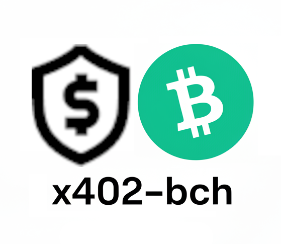

# x402 payments protocol for Bitcoin Cash

This repository is modeled on the original [x402 repository](https://github.com/coinbase/x402/tree/main) created by Coinbase. While their specifications and examples for x402 implementation is focused the USDC stablecoin on the Base blockchain, this repository is focused on an implementation for the Bitcoin Cash (BCH) blockchain. The techniques used by the x402-bch protocol can be adapted for any L1 UTXO-based blockchain.

## x402 vs x402-bch

A complete technical comparison can be done between the [x402 specification](./specs/x402-specification.md) and the [x402-bch specification](./specs/x402-bch-specification.md). Here are the high level differences between the two protocols:

- In both, there are three main actors in the protocol: Clients, Servers, and Facilitators
  - Servers offload all the blockchain-specific activity to the Facilitator
- In x402-bch, the Facilitator does not need its own wallet. Clients pay Servers directly, and Facilitators validate payment.
- Clients send a 'batch' payment to the Server, then debit against that payment with subsequent calls. This significantly reduces the number of on-chain transactions, and thus reduces fees incurred by the Client.

An example implementation is available in the [examples directory](./examples).

 
 

[)](https://youtu.be/3MHP8AvLlwQ)
